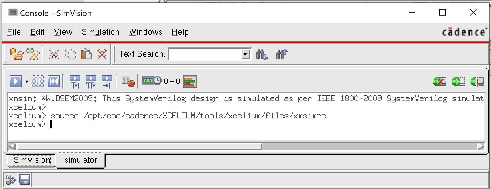
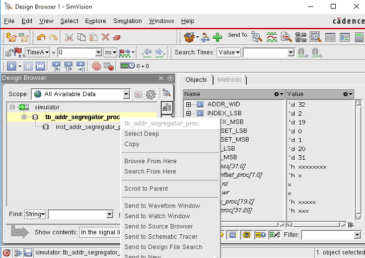
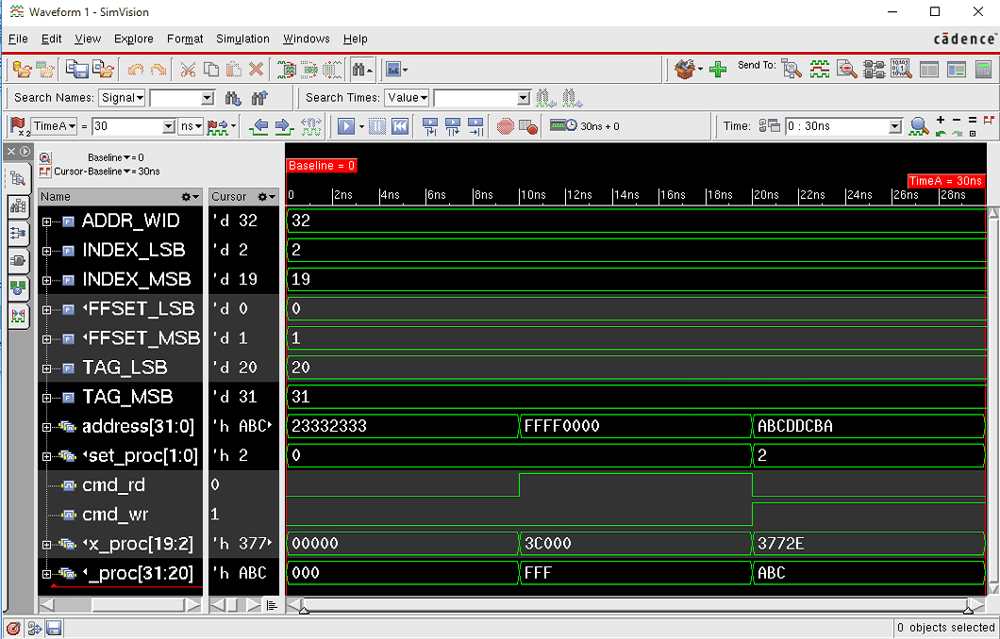
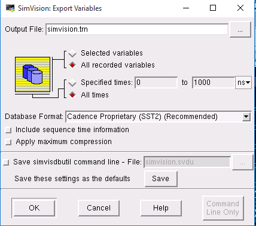
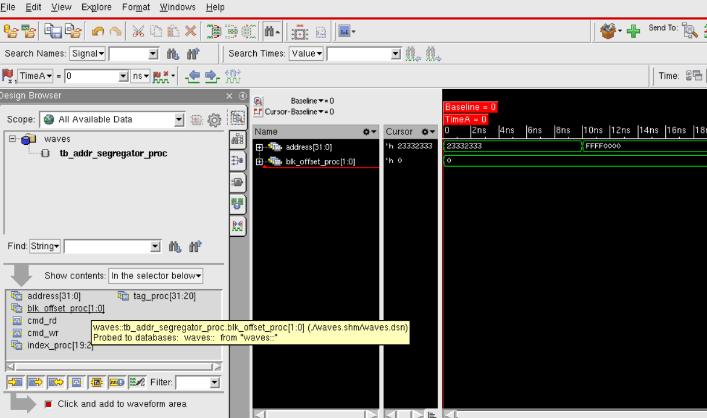

# Lab 1 — Introduction to Cadence Simulation

**CSCE 616 / 700 · Introduction to Hardware Design Verification**
Fall 2026 · Instructor: David Kebo Houngninou

Released: Monday, August 24, 2026, 9:00 AM CT
**Due: Monday, August 31, 2026, 11:59 PM CT**

> This page is the authoritative version of the handout and may be corrected
> after release. The copy in your assignment repository does not update. Check
> the [revision history](#revision-history) at the bottom before you submit.

---

## 1. Objectives

By the end of this lab you will be able to:

1. Log in to the ECE Linux server and load the Cadence toolchain for this course.
2. Accept and clone a lab assignment through Classroom 50.
3. Compile and elaborate a SystemVerilog design and testbench with Cadence Xcelium.
4. Drive a simulation from the Xcelium console and inspect signals in the waveform viewer.
5. Write an expected-value model that is derived from a specification rather than copied from an implementation.
6. Write a self-checking testbench that reports pass or fail on its own, without waveform inspection.
7. Extend a directed test into a randomized regression, and explain what randomization finds that directed tests do not.
8. Submit work by committing and pushing to your assignment repository.

---

## 2. Background

### 2.1 Design under test

Your first design under test (DUT) is `addr_segregator_proc` — an address decoder
for a cache memory system. It takes a 32-bit address and splits it into the three
fields a cache controller needs: the **tag**, the **index**, and the **block offset**.

The module is purely combinational. When either `cmd_rd` or `cmd_wr` is asserted,
it drives the three extracted fields onto its outputs. When neither is asserted,
it drives zeros.

### 2.2 Parameters

The field boundaries are parameterized. The default values are:

| Parameter | Value | Meaning |
| --- | --- | --- |
| `ADDR_WID` | 32 | Total address width |
| `TAG_MSB : TAG_LSB` | 31 : 20 | Tag field — 12 bits |
| `INDEX_MSB : INDEX_LSB` | 19 : 2 | Index field — 18 bits |
| `OFFSET_MSB : OFFSET_LSB` | 1 : 0 | Block offset — 2 bits |

### 2.3 Interface

| Signal | Direction | Width | Description |
| --- | --- | --- | --- |
| `cmd_rd` | input | 1 | Read request |
| `cmd_wr` | input | 1 | Write request |
| `address` | input | 32 | Address to decode |
| `tag_proc` | output | 12 | Extracted tag |
| `index_proc` | output | 18 | Extracted index |
| `blk_offset_proc` | output | 2 | Extracted block offset |

---

## 3. Environment setup

### 3.1 Prerequisites

You need an **ECEN Unix account**, regardless of whether you are enrolled through
CSCE or ECEN. If you do not have one, contact
[TAMU Help Desk Central](https://it.tamu.edu/help/) immediately — this blocks
every lab in the course.

**macOS users:** install [XQuartz](https://www.xquartz.org/) to enable graphical
windowing.

**Off-campus:** the Cadence tools are only reachable from inside the university
network. Connect to the TAMU VPN before starting SSH — see
[connect.tamu.edu](https://connect.tamu.edu).

### 3.2 Log in to the Linux server

Connect to the Olympus server with X11 forwarding enabled. The `-Y` flag lets
graphical applications running on the server display their windows on your own
machine.

```bash
ssh -Y <netid>@olympus.ece.tamu.edu
```

Once you are logged in, load the course toolchain:

```bash
load-csce-616
```

**First time using a TAMU Linux server?** You must set up your home directory
before anything else. Follow the steps at
[tamuengr.atlassian.net/l/cp/uNUrkbBa](https://tamuengr.atlassian.net/l/cp/uNUrkbBa).

### 3.3 Get your repository

This course distributes assignments through **Classroom 50**. Your work still
lives in a GitHub repository — Classroom 50 creates and manages that repository
for you.

1. Accept the invitation to the course GitHub organization. GitHub emails this to
   you at the start of the semester, and you only do it once.
2. Sign in to [classroom50.org](https://classroom50.org) with your GitHub account.
3. Open the Lab 1 assignment link posted on Canvas and accept the assignment.
   Your repository is created automatically.
4. Clone your repository onto the Olympus server.

If your name is missing from the roster, or you signed in with the wrong GitHub
account, message the instructor on Discord — do not create a second account.

### 3.4 Set up the Cadence environment

There are two setup steps and they do different things:

- `load-csce-616` (section 3.2) makes the course's tool modules visible to your
  shell. Run it once per login session.
- `setupX.bash` sets the Cadence environment variables for this repository —
  `UVMHOME`, the Xcelium paths, and the vManager paths. Run it from the root of
  your cloned repository.

From your repository root:

```bash
source setupX.bash
```

Confirm the tool is on your path:

```bash
xrun -version
```

You should see:

```
TOOL:   xrun    22.03-s012
```

If you see anything else — or a `command not found` error — your environment is
not set up. Re-run both steps above before continuing.

### 3.5 Repository layout

Change into the working directory:

```bash
cd work
```

The repository is organized as follows:

| Directory | Contents |
| --- | --- |
| `work/design/common/` | Design files. For this lab, `addr_segregator_proc.sv`. |
| `work/tb/` | Testbench files. For this lab, `tb_addr_segregator_proc.sv`. |
| `work/sim/` | Simulation control files and results. Contains `run.f`. |
| `.gitignore` | Excludes Xcelium and SimVision build output from Git. Do not delete it. |

Simulation output — compiled libraries, logs, and waveform databases — is
generated inside `work/sim/` when you run a simulation. These generated files are
ignored by Git, with the exception of the waveform database you are asked to
submit in section 6.

---

## 4. Walkthrough

### Part 1 — Run a simulation using the provided testbench

**Step 1.** Change to the simulation directory and open `run.f` in a text editor.

```bash
cd work/sim
```

This file is the command file that drives the simulation. Read the comments to
understand what each option does:

| Option | Purpose |
| --- | --- |
| `+access+rwc` | Allow probes to read, write, and connect to signals — required for waveform recording |
| `-timescale 1ns/1ns` | Set simulation time unit and precision |
| `-gui` | Launch the graphical interface |
| `-incdir ../design/common` | Add an include search directory |

The remaining lines list the design and testbench files to compile, in order.

**Step 2.** Launch Cadence Xcelium:

```bash
xrun -f run.f
```

`xrun` compiles and elaborates every file listed in `run.f`. Two windows open:
the **console** and the **design browser**.



*Figure 1 — the Xcelium console.*


*Figure 2 — the design browser, with the instance right-click menu.*

**Step 3.** In the design browser, select `tb_addr_segregator_proc`. You will see
the testbench hierarchy and its instances. Right-click any instance and choose
**Send to Waveform Window** to add all of its signals to the waveform viewer. To
add signals individually, select them in the **Object** pane on the right and
send those instead.

**Step 4.** In the console window, start the simulation. To run to completion:

```
run
```

To advance by a fixed amount of time instead:

```
run 100ns
```

The waveform viewer populates as the simulation advances.



*Figure 3 — the waveform viewer after a full run.*

**Step 5.** Verify the DUT behaves as expected. The testbench as shipped drives
three test cases; their correct outputs are:

| Time | `cmd_rd` | `cmd_wr` | `address` | Tag | Index | Offset |
| --- | --- | --- | --- | --- | --- | --- |
| 0–10 ns | 0 | 0 | `0x2333_2333` | `0x000` | `0x00000` | `0x0` |
| 10–20 ns | 1 | 0 | `0xFFFF_0000` | `0xFFF` | `0x3C000` | `0x0` |
| 20–30 ns | 0 | 1 | `0xABCD_DCBA` | `0xABC` | `0x3772E` | `0x2` |

Note that in the first case neither command is asserted, so all three outputs are
zero even though `address` is non-zero.

**Step 6.** Export the waveform database. Click **File → Export**, choose
**All recorded variables**, and click **OK**.



*Figure 4 — exporting the waveform database.*

**Step 7.** To reopen a saved waveform database later without rerunning the
simulation:

1. At the shell prompt, run `simvision`
2. Click **File → Open Database**
3. Select your database — the default name is `waves.shm`
4. Once loaded, click **waves → tb_addr_segregator_proc**. All signals in that
   hierarchy appear in the pane below; clicking a signal adds it to the waveform
   display.



*Figure 5 — reopening a saved database in SimVision.*

### Part 2 — Read the testbench

Open `work/tb/tb_addr_segregator_proc.sv`. This testbench is a self-checking one.
Most of it is scaffolding you are given; the parts marked `TODO` are the lab.

It has five parts:

- **Declarations** — the parameters mirroring the DUT, plus three `localparam`
  field widths (`TAG_WID`, `INDEX_WID`, `OFFSET_WID`) derived from those
  parameters. Nothing in the testbench should hardcode 12, 18 or 2. If someone
  re-parameterizes the cache geometry, a testbench built on these widths still
  checks the right thing.
- **Instantiation** — the DUT instance, `inst_addr_segregator_proc`.
- **Expected-value model** — three functions, `expected_tag`, `expected_index`
  and `expected_offset`, that answer the question "what *should* this field be
  for this address?" These are stubs. You write them.
- **`check_addr`** — the task that applies one transaction and checks every
  output against the model. Also a stub.
- **Simulation control** — the `initial` block: a banner, the directed cases, the
  randomized regression, and the final summary.

Read `check_addr`'s argument list before you write anything else. The `hold`
argument is how long the stimulus stays on the bus, which is what shapes the
waveform; `quiet` suppresses the per-case PASS line so that a two-hundred-case
regression does not bury its own failures.

You have already run this testbench in Part 1. It elaborated, drove the three
directed cases, and finished at 30 ns having checked nothing at all. That is your
starting point: a testbench that runs green and verifies nothing is exactly the
failure mode this lab is about.

---

## 5. To-do

### Task 1 — Add two directed test cases

Extend the directed section of `work/tb/tb_addr_segregator_proc.sv`, keeping the
style of the three existing calls:

- **Test case 4:** a write request to address `0xFEEDC0DE`, held for 30 time units.
- **Test case 5:** a read request to address `0xC00010FF`, held for 60 time units.

The five directed cases must occupy 0–120 ns exactly. That window is what you
capture in Task 6.

### Task 2 — Write the expected-value model

Fill in `expected_tag`, `expected_index` and `expected_offset`. Each takes an
address and an `active` flag, and returns what that field should be — or zero
when `active` is low, because the DUT drives zeros when neither command is
asserted.

Derive each field by shifting the address down to bit 0 and masking off the bits
above the field, using the `*_LSB` parameters and the `*_WID` localparams.

**Do not write `address[TAG_MSB : TAG_LSB]`.** That is the DUT's own expression.
A checker that reuses the implementation's logic will agree with that logic no
matter how wrong it is. The point of an expected-value model is that it is an
independent second opinion, so it has to be derived independently.

Build your mask in 64-bit arithmetic. Work out for yourself what `1 << 32` would
produce if a future lab widened one of these fields, and why that is a bug that
would not show up today.

### Task 3 — Write the `check_addr` task

The comment block above the stub lists the eight things your implementation must
do. Three of them are worth dwelling on:

- **Wait `#1` after driving, before you sample.** Reading the outputs in the same
  simulation delta as the drive is a race: you may read the DUT's previous value.
  A real testbench solves this with a clock; this DUT has none, so a delay stands in.
- **Compare with `!==`, not `!=`.** If an output goes to X, `!=` yields X, which
  an `if` treats as false — the check silently passes. `!==` compares X as a value
  and reports it.
- **`$error` must name the signal, the expected value and the actual value.** A
  failure message that says only "mismatch" costs the next person a debug session.

Route all five directed cases through this task.

### Task 4 — Add a randomized regression

After the directed cases, run `NUM_RANDOM` transactions through the *same*
`check_addr` task: a random address from `$urandom`, and one of the three command
encodings the specification defines — idle, read, or write. Hold each for
`RANDOM_HOLD` time units and run them quiet.

Note what is *not* in that list: asserting `cmd_rd` and `cmd_wr` at the same time.
Read section 2.1 again. The specification says what happens when either is
asserted and when neither is; it does not say what a simultaneous read and write
means. The DUT will happily decode one. **Do not generate that case** — you would
be checking behavior nobody specified. Come to office hours or Discord with an
opinion about what the design *should* do; we will pick this up in a later lab.

### Task 5 — Summarize and fail loudly

End the run with a summary: `checks_run`, `checks_failed`, and a single
`PASS`/`FAIL` verdict. If anything failed, call `$fatal`.

A simulation that ends quietly looks identical to one that passed. The summary is
what makes the difference visible without reading two hundred lines of log.

A correct run ends like this:

```
==============================================================
  checks run    : 205
  checks failed : 0
  RESULT        : PASS
==============================================================
```

### Task 6 — Capture the waveform image

Run the completed testbench and capture the waveform for the **directed window,
0 to 120 ns**, showing all signals. Save it as `cache_waveform.png` in the root of
your repository.

Capture only the directed window. The randomized transactions that follow are
verified by the checker, not by eye, and at 2 ns apiece they make the image
unreadable.

### Task 7 — Export the waveform database

In the waveform viewer, click **File → Export**, choose **All recorded
variables**, and save the database as `cache_waveform` inside `work/sim/`.

### Task 8 — Check your checker

Everything above passes on the first run, because the DUT is correct. That should
make you suspicious: you have built a fault detector and never once seen it detect
a fault. Run these two experiments on a *temporary* copy of the design.

**Experiment 1 — a fault directed testing catches.**

In `work/design/common/addr_segregator_proc.sv`, shift the index field by one bit:

```systemverilog
index_proc = address[INDEX_MSB+1 : INDEX_LSB+1];   // temporary fault
```

Rerun. You should see `$error` lines naming `index_proc` with expected and actual
values, `checks_failed` at 135, a `FAIL` verdict, and `$fatal` ending the run.
Four of the five directed cases catch this one on their own — only `directed-1`
misses it, and only because both commands are deasserted there, so the outputs
are zero either way.

**Experiment 2 — a fault directed testing does not catch.**

Restore the design, then transpose two adjacent bits of the index instead:

```systemverilog
index_proc = {address[INDEX_MSB-1], address[INDEX_MSB],
              address[INDEX_MSB-2 : INDEX_LSB]};    // temporary fault
```

Rerun and look carefully at the result:

```
[1]  PASS directed-1 ...
[11] PASS directed-2 ...
[21] PASS directed-3 ...
[31] PASS directed-4 ...
[61] PASS directed-5 ...
  checks run    : 205
  checks failed : 66
  RESULT        : FAIL
```

**Every directed case passes.** All 66 failures come from the randomized
regression. Had you stopped at Task 3, this design would have shipped.

Work out why before reading on. The answer is that your five directed addresses
share an accidental property: `0xFFFF0000`, `0xABCDDCBA`, `0xFEEDC0DE` and
`0xC00010FF` all happen to have bit 19 equal to bit 18. Swapping two bits that are
already equal changes nothing, so the fault is invisible to every vector you chose.
It is wrong for half of all addresses — your five just were not among them.

Nobody picked those addresses badly. They were picked to look varied, and they are
varied. The property that mattered is one no reasonable person would have thought
to vary, which is precisely the point: directed tests can only find the bugs you
thought of, and this is a bug nobody thinks of.

Write two or three sentences in your commit message describing what you learned
from Experiment 2. This idea — that a test suite passing tells you less than you
think — is the foundation for the coverage and constrained-random labs later in
the term.

**Restore the design before you submit.**

```bash
git checkout work/design/common/addr_segregator_proc.sv
```

Deliverable 1 is the design *unmodified*, and a submission whose own checker
reports `FAIL` receives no credit for tasks 2 through 5. Confirm with `git diff`
that the only file you changed is the testbench.

---

## 6. Deliverables

Commit and push all of your changes to your assignment repository. Your repository
must contain:

| # | Path | Description |
| --- | --- | --- |
| 1 | `work/design/common/addr_segregator_proc.sv` | The design, unmodified |
| 2 | `work/tb/tb_addr_segregator_proc.sv` | The completed testbench — directed cases 4 and 5, the expected-value model, `check_addr`, the randomized regression, and the summary |
| 3 | `work/sim/cache_waveform` | The exported waveform database |
| 4 | `cache_waveform.png` | The waveform image of the directed window, 0 to 120 ns |

Your submitted testbench must end in `RESULT : PASS` with `checks_failed` at zero
and `checks_run` at 205. Any other outcome means either the design or your checker
is wrong, and both are your responsibility to find before you push.

**File names are graded literally.** A file with the right contents under the wrong
name receives no credit. Verify your submission by cloning your repository into a
fresh directory and confirming all four items are present.

---

## 7. Getting help

- **Public questions** — post on the course Discord server. Most setup problems
  have already been answered there.
- **Private questions** — email the instructor at davidkebo@tamu.edu.
- **Office hours and help sessions** — see the syllabus for times.

You may discuss this lab conceptually with classmates. The implementation you
submit must be your own work. See the syllabus for the full collaboration and
academic integrity policy.

---

## Revision history

Changes made to this handout after release are listed here, newest first.

| Date | Change |
| --- | --- |
| Aug 24, 2026 | Initial release for Fall 2026. |
